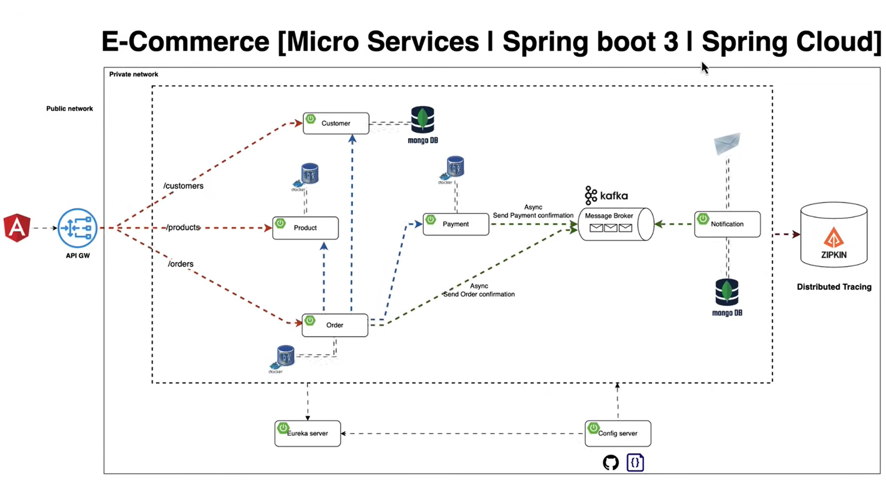

# 🛒 E-Commerce Microservices Platform

A cloud-native, microservices-based e-commerce application built with **Spring Boot 3**, **Spring Cloud**, and **Keycloak** for secure, distributed architecture. This platform handles everything from customer registration and order processing to payment, notification, and distributed tracing.

---

## 🧱 Architecture Overview



### Microservices
- **API Gateway**: Entry point for all frontend requests. Routes traffic to microservices and secures endpoints with Keycloak.
- **Customer Service**: Manages customer profiles and user data. MongoDB-based.
- **Product Service**: Catalog of available products with price and stock management.
- **Order Service**: Manages order creation, status tracking, and inventory reservation.
- **Payment Service**: Processes payment requests and confirms transactions.
- **Notification Service**: Sends async emails/SMS using Kafka consumers.
- **Config Server**: Centralized configuration for all services.
- **Eureka Server**: Service discovery and registration center.
- **Kafka Broker**: Enables asynchronous messaging between services.
- **Zipkin**: Distributed tracing across microservices.

---

## 🔐 Authentication & Authorization

- **Keycloak** is used to manage:
  - Single Sign-On (SSO)
  - Role-based access control (RBAC)
  - Token-based security for REST endpoints
- API Gateway validates access tokens and routes secure requests

---

## ⚙️ Tech Stack

| Layer               | Technology                        |
|--------------------|-----------------------------------|
| Backend Framework  | Spring Boot 3                     |
| Cloud Tools        | Spring Cloud Gateway, Eureka, Config Server |
| Messaging          | Apache Kafka                      |
| Auth               | Keycloak (OAuth2 + OpenID Connect) |
| Tracing            | Zipkin                            |
| Persistence        | MongoDB, PostgreSQL               |
| API Docs           | SpringDoc OpenAPI + Swagger UI    |
| Containerization   | Docker, Docker Compose            |
| Frontend           | Angular (via API Gateway)         |

---

## 📦 Modules Overview

### 🧍 Customer Service
- CRUD for customers
- MongoDB persistence
- Protected by Keycloak

### 📦 Product Service
- Manage product catalog
- Inventory tracking
- Pricing logic

### 🧾 Order Service
- Place and retrieve orders
- Communicates with product & payment service
- Async confirmation via Kafka

### 💳 Payment Service
- Validates and processes payments
- Sends confirmation via Kafka topic

### 📧 Notification Service
- Kafka consumer
- Sends emails/SMS (mock or real integration)

---

## 🚀 Running the Project

```bash
# Start the full stack with Docker Compose
docker-compose up --build
```

Services will be available at:

- API Gateway: http://localhost:8222
- Keycloak: http://localhost:8081
- Swagger UI: http://localhost:8222/swagger-ui.html

---

## 🧪 Swagger Documentation

Each service provides its own OpenAPI spec, aggregated through the API Gateway.

- `GET /v3/api-docs/customer-service`
- `GET /v3/api-docs/product-service`
- `GET /v3/api-docs/order-service`
- `GET /v3/api-docs/payment-service`
- `GET /v3/api-docs/notification-service`

---

## 🔎 Tracing with Zipkin

- Visit: http://localhost:9411
- View complete traces across microservice calls

---

## 🔐 Security with Keycloak

- Admin Console: http://localhost:8081/admin
- Default Realm: `ecommerce`
- Clients: `angular-client`, `spring-gateway`
- Roles: `USER`, `ADMIN`

---

## 📬 Kafka Topics

| Topic Name           | Description                      |
|----------------------|----------------------------------|
| `order-events`       | Order created, processed events  |
| `payment-events`     | Payment confirmation events      |
| `notification-events`| Notification dispatch triggers   |

---

## 📂 Folder Structure

```
ecommerce-microservices/
│
├── api-gateway/
├── customer-service/
├── product-service/
├── order-service/
├── payment-service/
├── notification-service/
├── config-server/
├── discovery-server/
├── docker-compose.yml
├── README.md
```

---

## 🤝 Contributing

Contributions are welcome! Please open issues or submit PRs with improvements, fixes, or new features.

---

## 📄 License

Licensed under the Apache 2.0 License. See [LICENSE](LICENSE) for details.
